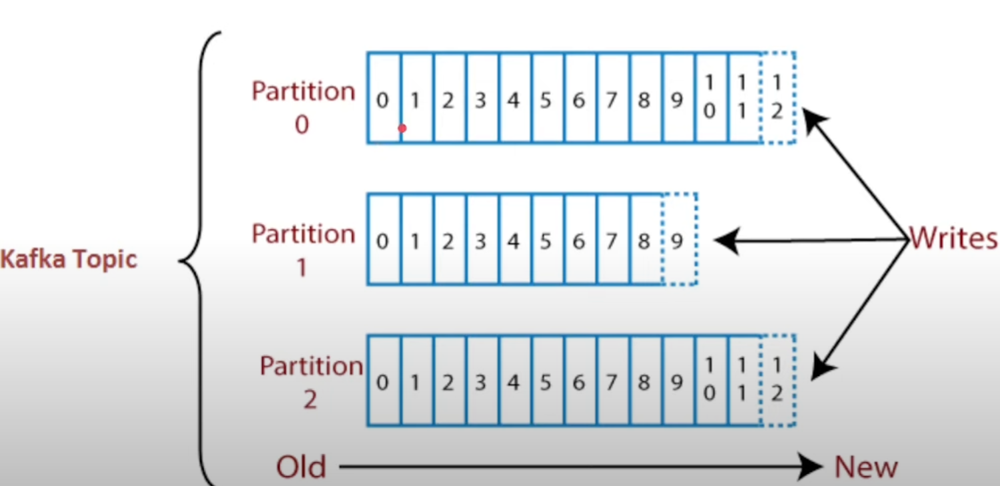

# master-dev-kafka
Tutorial: Spring Boot + Kafka

## Spring Boot + Kafka: Simples assim - parte 1:

### Anotações Parte 1:
* O Apache Kafka é uma plataforma Open Source que tem capacidade de trabalhar com Streaming de Dados.
* Possui alta performance, alta disponibilidade e uma confiabilidade muito grande, pois consegue lidar com muitos dados.
* O Kafka é um sistema distribuído, ou seja, ele pode ser executado em um cluster de máquinas.
* É capaz de receber mensagens de um sistema e entregar para outro (Produtor e Consumidor).
* Também podemos salvar as mensagens recebidas pelo Kafka em um banco de dados utilizando algumas bibliotecas prontas para isso.
* Dentro dos Brokers tempos basicamente (mas não só isso) os Tópicos e Partições que são utilizados para receber e armazenar as mensagens.
* Funcionamento:
  * Imagine duas aplicações querendo se comunicar de forma assíncrona.
  * Então teremos uma aplicação produzindo a mensagem e enviando ao broker do Kafka.
  * Essa mensagem é enviada à um Tópico e armazenada em uma Partição.
  * Então a segunda aplicação, consumidora nesse caso, terá o trabalho de ir buscar as mensagens de interesse da mesma dentro da partição.
* Quando um produtor envia uma mensagem, a mesma será armazenada em uma posição dentro de uma partição.
* O tópico pode ter 1 ou mais partições E essas partições são divididas em pequenas partes, como pode ser visto abaixo:
* 
* Quando um consumidor vai buscar uma mensagem, ele vai buscar a partir de um offset. Se nada for informado, ele buscará a partir do offset 0.
* 